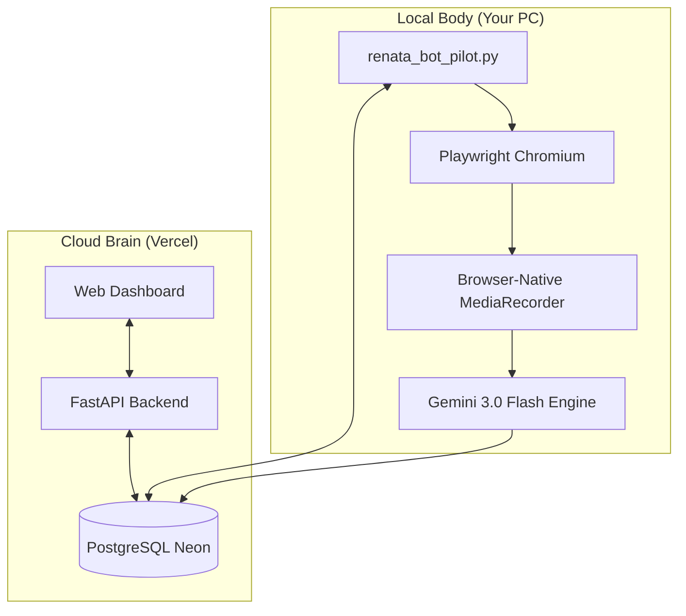

# RENATA - AI Meeting Intelligence Platform

**Live Application**: [meet.nexren.ai](https://meet.nexren.ai)

RENATA is an autonomous meeting intelligence platform. It joins your Google Meet and Zoom calls as a silent bot, records the audio via native browser capture, and generates structured AI-powered reports — transcripts, summaries, action items, speaker analytics, and a searchable knowledge base — all from a professional cloud dashboard.

---

## ⚡ The Zero-Driver Breakthrough (New!)

Unlike other self-hosted bots that require complex virtual audio cables (VB-Cable), virtual drivers, or disabling Windows Secure Boot, **RENATA 2.0** uses a custom **Browser-Native MediaRecorder** architecture.

- ✅ **No Drivers Needed**: No VB-Cable, no SAR, no VAC.
- ✅ **Total Isolation**: Record 5+ meetings at once; audio streams never mix.
- ✅ **Secure Boot Friendly**: Works on any standard Windows/Mac/Linux machine.
- ✅ **Opus-Quality**: Captures high-fidelity WebM audio directly from the meeting's WebAudio context.

---

## 🏛️ Architecture Overview

RENATA uses a split "Brain and Body" architecture to provide cloud features without the high cost of running high-RAM browser automation in a serverless environment.



---

## ✨ Features

### 🤖 Autonomous Meeting Bot
- **Zero-Touch Join**: Automatically joins meetings from your Google Calendar.
- **Support**: High-performance automation for **Google Meet** and **Zoom**.
- **Silent Mode**: Mutes camera/mic and hides automation "infobars" for a professional presence.
- **Auto-Leave**: Exits automatically when the meeting ends or when everyone else has left.

### 🧠 Intelligence Suite
- **Gemini 3.0 Flash**: Powered by the fastest, newest frontier models for 1:1 transcription accuracy.
- **Hinglish Support**: Expertly handles mixed Hindi/English dialogue in Roman script.
- **MoM & Action Items**: Generates professional Minutes of Meeting and owner-assigned tasks.
- **Speaker Analytics**: Tracks engagement and talk-time per participant.

### 📊 Professional Hub
- **Intelligence Hub**: A centralized list view to access all AI notes with one click.
- **PDF Export**: Generates premium PDF reports with full multilingual support.
- **RAG Search**: Natural language search (e.g., "What did we decide about the budget last Friday?") across all past meetings.

---

## 🛠️ Tech Stack

| Layer | Technology |
|---|---|
| **Core Engine** | Google Gemini 3.0 Flash & 2.5 Flash |
| **Automation** | Playwright (Chromium) & Stealth.js |
| **Audio** | Browser-Native MediaRecorder (WebM/Opus) |
| **Backend** | FastAPI / Python 3.11 |
| **Frontend** | Vanilla JS / CSS (Modern Glassmorphism) |
| **Database** | PostgreSQL (Neon / Cloud) |
| **Search** | ChromaDB (Vector Store) |

---

## 🚀 Getting Started (Local Setup)

### 1. Prerequisites
- **Python 3.11** (Recommended)
- **Playwright**: Installed via `playwright install chromium`
- That's it! (No virtual audio drivers required for 2.0+)

### 2. Installation
```bash
# Clone the repository
git clone https://github.com/Chandisha/RENATA_Notes_AI.git
cd RENATA_Notes_AI

# Setup Environment
python -m venv venv
source venv/bin/activate  # Windows: .\venv\Scripts\activate
pip install -r requirements.txt
playwright install chromium
```

### 3. Environment Config (.env)
Create a `.env` file with these keys:
```env
# AI & Intelligence
GEMINI_API_KEY=your_key_here
AUDIO_DRIVER=browser  # The default high-performance engine

# Database (Shared with Vercel)
DATABASE_URL=postgresql://your_neon_db_url

# Bot Identity
BOT_EMAIL=renata@nexren.ai
BOT_PASSWORD=your_pass
```

### 4. Running the Bot
```bash
python renata_bot_pilot.py
```

---

## 📂 Project Structure

- **`main.py`**: Cloud Backend & Dashboard API.
- **`renata_bot_pilot.py`**: The meeting joiner logic.
- **`meeting_notes_generator.py`**: The AI processing pipeline.
- **`v3-frontend/`**: The modern dashboard UI.

---

## 🤝 Support & Development

**Developer**: [Chandisha Das](https://github.com/Chandisha)

RENATA is an open-source alternative to commercial tools, giving you full control over your meeting data and AI costs.
